1) How can you retrieve all the information from the cd.facilities table?
    ```sql
    SELECT * FROM cd.facilities
    ```
    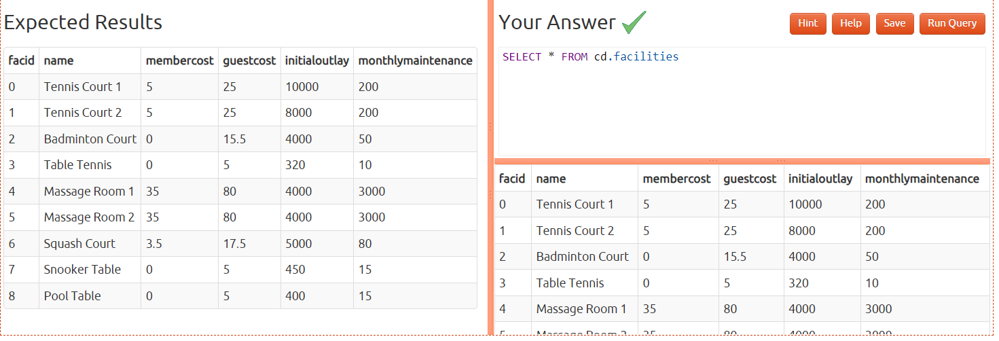
    <br>
2) You want to print out a list of all the facilities and their cost to members. How would you retrieve a list of only facility names and costs?
    ```sql
    SELECT name, membercost FROM cd.facilities
    ```
    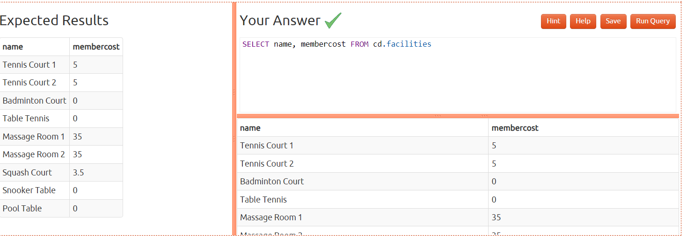
    <br>

3) How can you produce a list of facilities that charge a fee to members?
    ```sql
    SELECT facid, name, membercost, guestcost, initialoutlay, monthlymaintenance FROM cd.facilities WHERE membercost > 0;
    ```
    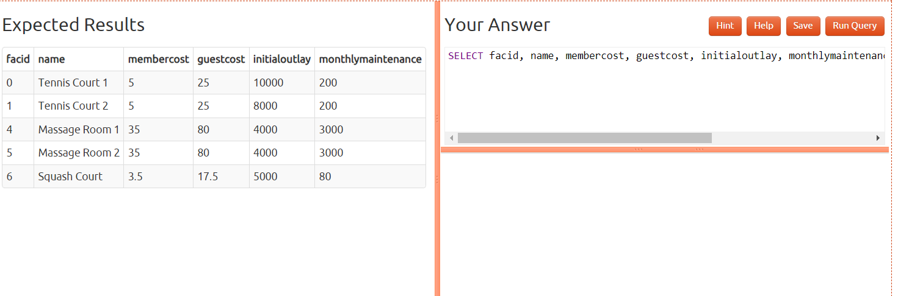

4) How can you produce a list of facilities that charge a fee to members, and that fee is less than 1/50th of the monthly maintenance cost? Return the facid, facility name, member cost, and monthly maintenance of the facilities in question.
    ```sql
    SELECT 	FACID, NAME, MEMBERCOST, MONTHLYMAINTENANCE FROM CD.FACILITIES WHERE (MEMBERCOST > 0) AND MEMBERCOST < (MONTHLYMAINTENANCE / 50)
    ```
    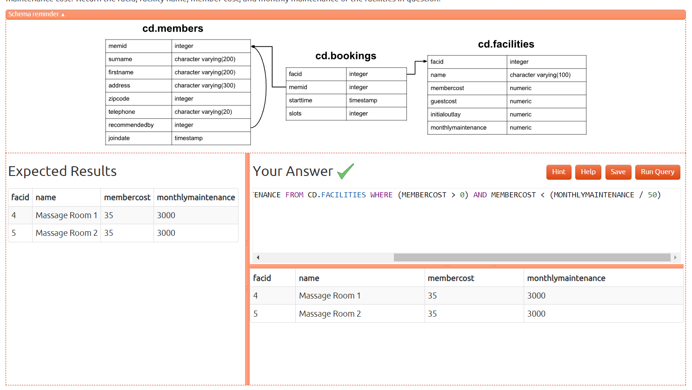
    <br>

5) How can you produce a list of all facilities with the word 'Tennis' in their name?
    ```sql
    SELECT FACID, NAME, MEMBERCOST, GUESTCOST, INITIALOUTLAY, MONTHLYMAINTENANCE FROM CD.FACILITIES WHERE NAME LIKE '%Tennis%'
    ```
    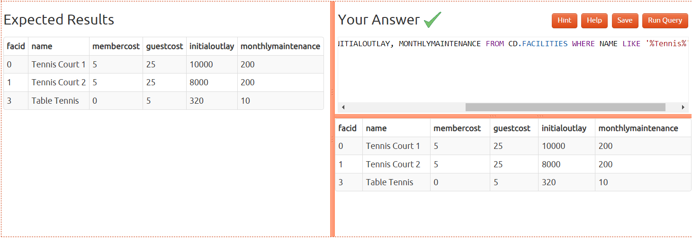
    <br>

6) How can you retrieve the details of facilities with ID 1 and 5? Try to do it without using the OR operator.
    ```sql
    select * from cd.facilities where facid IN (1, 5)
    ```
    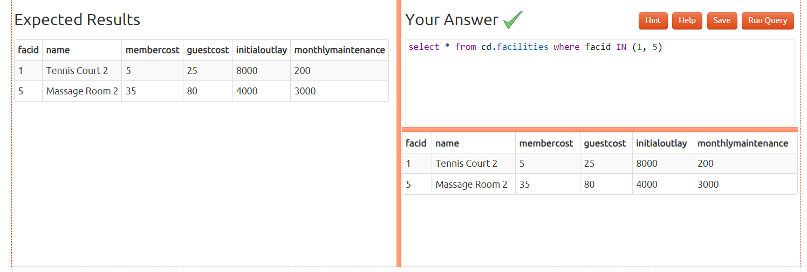
    <br>

7) How can you produce a list of facilities, with each labelled as 'cheap' or 'expensive' depending on if their monthly maintenance cost is more than $100? Return the name and monthly maintenance of the facilities in question.
    ```sql
    SELECT name,
    CASE WHEN (monthlymaintenance > 100) THEN
    'expensive'
    ELSE
    'cheap'
    END cost FROM cd.facilities
    ```
    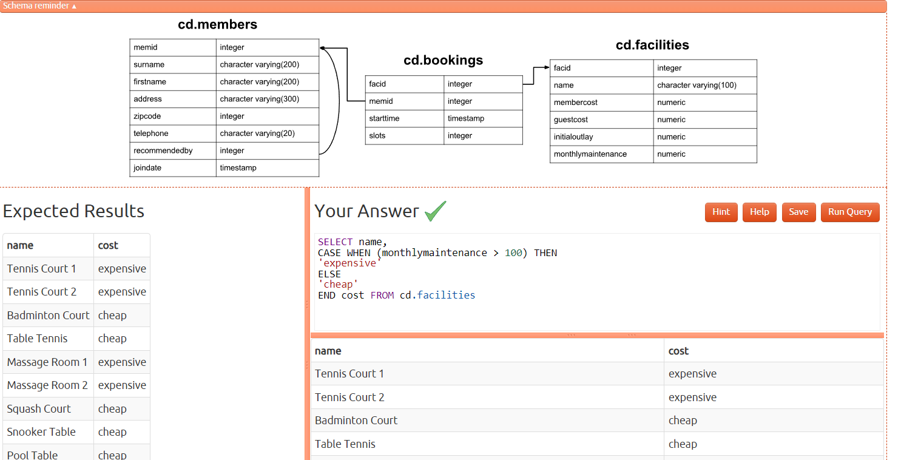
    <br>

8) How can you produce a list of members who joined after the start of September 2012? Return the memid, surname, firstname, and joindate of the members in question
    ```sql
    SELECT memid, surname, firstname, joindate FROM cd.members WHERE joindate >= '2012-09-01'
    ```
    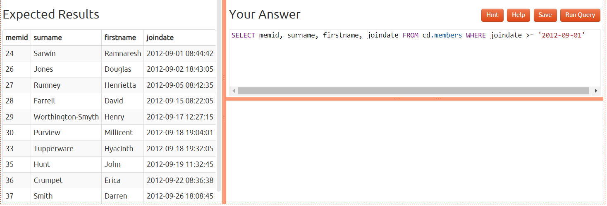

9) How can you produce an ordered list of the first 10 surnames in the members table? The list must not contain duplicates.
    ```sql
    SELECT DISTINCT surname FROM cd.members ORDER BY surname LIMIT 10
    ```
    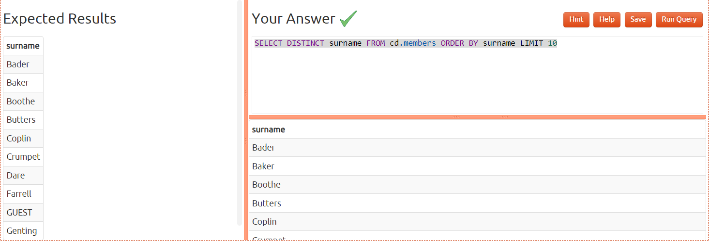

8) You, for some reason, want a combined list of all surnames and all facility names. Yes, this is a contrived example :-). Produce that list!
    ```sql
    SELECT * FROM author
    ```
      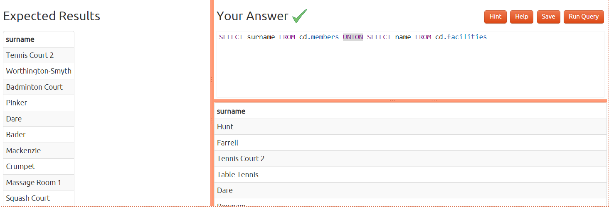
    <br>
  
9) You'd like to get the signup date of your last member. How can you retrieve this information?
    ```sql
    SELECT MAX(joindate) FROM cd.members
    ```
    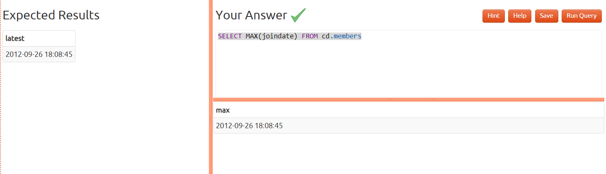
    <br>

10) You'd like to get the first and last name of the last member(s) who signed up - not just the date. How can you do that?
    ```sql
    SELECT firstname, surname, joindate FROM cd.members WHERE joindate = (SELECT MAX(joindate) FROM cd.members)
    ```
    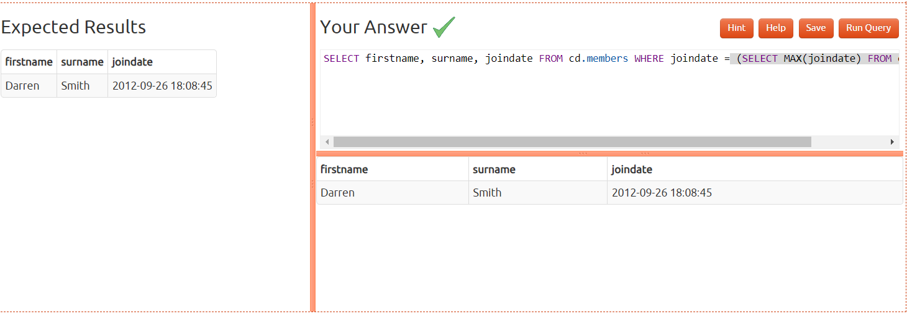
    <br>