## Joins 
_________

1) How can you produce a list of the start times for bookings by members named 'David Farrell'?
    ```sql
    SELECT starttime
    FROM cd.bookings bks
    INNER JOIN cd.members mems
    ON mems.memid = bks.memid
    WHERE mems.firstname = 'David' AND
    mems.surname = 'Farrell'
    ```
   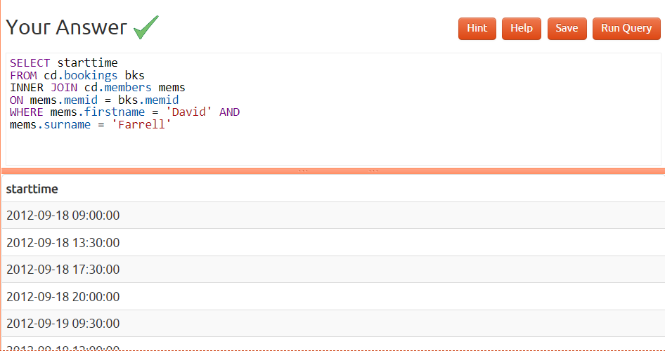

2) How can you produce a list of the start times for bookings for tennis courts, for the date '2012-09-21'? Return a list of start time and facility name pairings, ordered by the time.
   ```sql
   SELECT bks.starttime AS start, flts.name AS name
   FROM cd.bookings bks
   INNER JOIN cd.facilities flts
   ON flts.facid = bks.facid
   WHERE
   bks.starttime >= '2012-09-21' AND
   bks.starttime < '2012-09-22' AND
   flts.name IN ('Tennis Court 1', 'Tennis Court 2')
   ORDER BY bks.starttime
   ```
   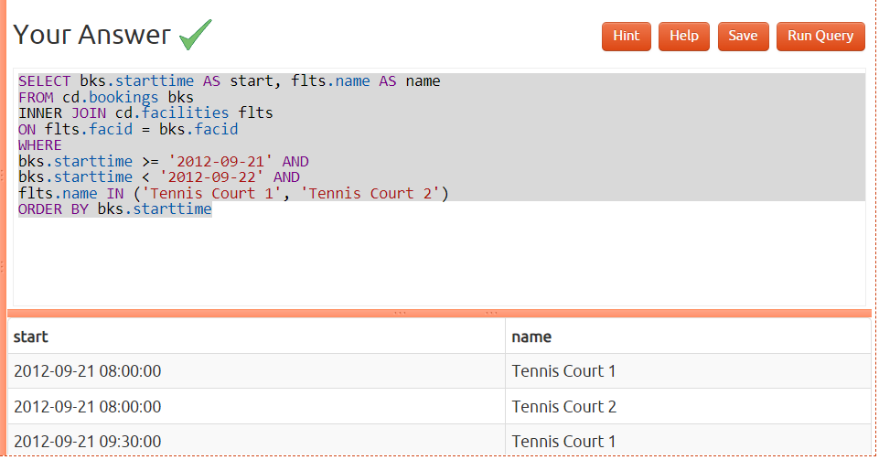

3) How can you output a list of all members who have recommended another member? Ensure that there are no duplicates in the list, and that results are ordered by (surname, firstname).
   ```sql
   SELECT DISTINCT recs.firstname, recs.surname
   FROM cd.members mems
   INNER JOIN cd.members recs
   ON recs.memid = mems.recommendedby
   ORDER BY surname, firstname
   ```
   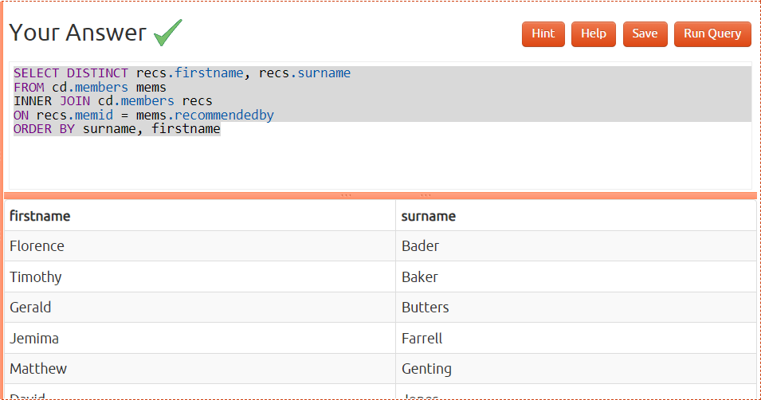 

4) How can you output a list of all members, including the individual who recommended them (if any)? Ensure that results are ordered by (surname, firstname).
   ```sql
   SELECT mems.firstname memfname, mems.surname memssname, recs.firstname recfname, recs.surname recsname
   FROM cd.members mems
   LEFT JOIN cd.members recs
   ON mems.recommendedby = recs.memid
   ORDER BY mems.surname, mems.firstname
   ```
   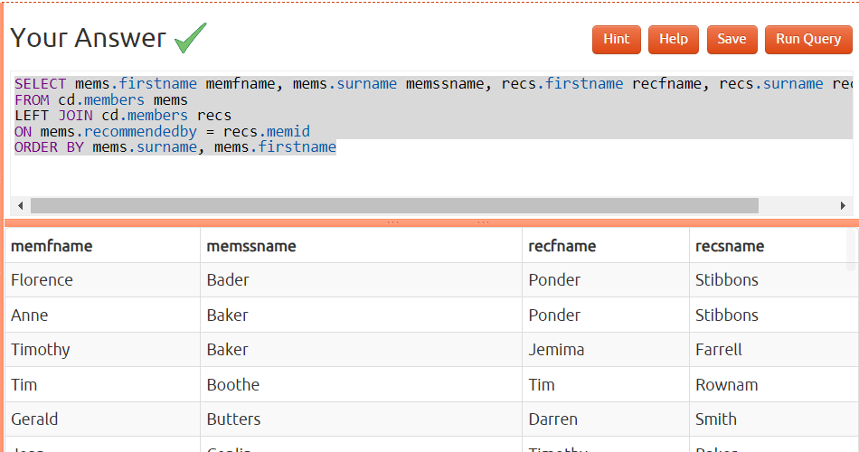
   
5) How can you produce a list of all members who have used a tennis court? Include in your output the name of the court, and the name of the member formatted as a single column. Ensure no duplicate data, and order by the member name followed by the facility name.
   ```sql
   SELECT DISTINCT mems.firstname || ' ' || mems.surname member, flts.name facility
   FROM cd.members mems
   INNER JOIN cd.bookings bks
   ON mems.memid = bks.memid
   INNER JOIN cd.facilities flts
   ON bks.facid = flts.facid
   WHERE flts.name IN ('Tennis Court 1', 'Tennis Court 2')
   ORDER BY member, facility
   ```
   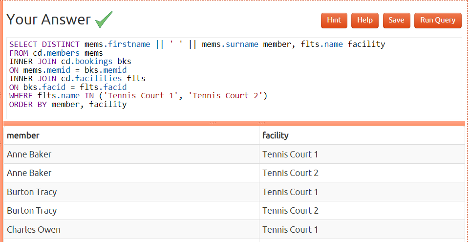

6) How can you produce a list of bookings on the day of 2012-09-14 which will cost the member (or guest) more than $30? Remember that guests have different costs to members (the listed costs are per half-hour 'slot'), and the guest user is always ID 0. Include in your output the name of the facility, the name of the member formatted as a single column, and the cost. Order by descending cost, and do not use any subqueries.
   ```sql
    SELECT mems.firstname || ' ' || mems.surname AS member, flts.name AS facility,
        CASE 
	        WHEN mems.memid = 0 THEN
	            bks.slots*flts.guestcost
		    ELSE
			    bks.slots*flts.membercost
	    END AS cost
	    FROM cd.facilities flts
		    INNER JOIN cd.bookings bks
		        ON bks.facid = flts.facid
		    INNER JOIN cd.members mems
		        ON mems.memid = bks.memid
	    WHERE bks.starttime >= '2012-09-14' AND bks.starttime < '2012-09-15' AND
		    ((mems.memid = 0 AND bks.slots*flts.guestcost > 30) OR (mems.memid != 0 AND bks.slots*flts.membercost > 30))
	    ORDER BY cost DESC
   ```
   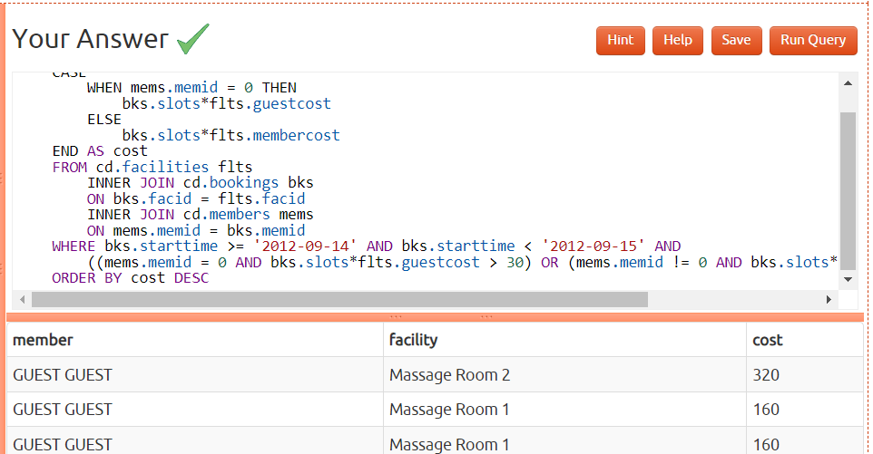

7) Produce a list of all members, along with their recommender, using no joins.
   ```sql
   SELECT DISTINCT mems.firstname || ' ' || mems.surname AS member, 
   (
    SELECT rec.firstname || ' ' || rec.surname AS recommender
    FROM cd.members rec
    WHERE mems.recommendedby = rec.memid
   )
   FROM
   cd.members mems
   ORDER BY member, recommender
   ```
   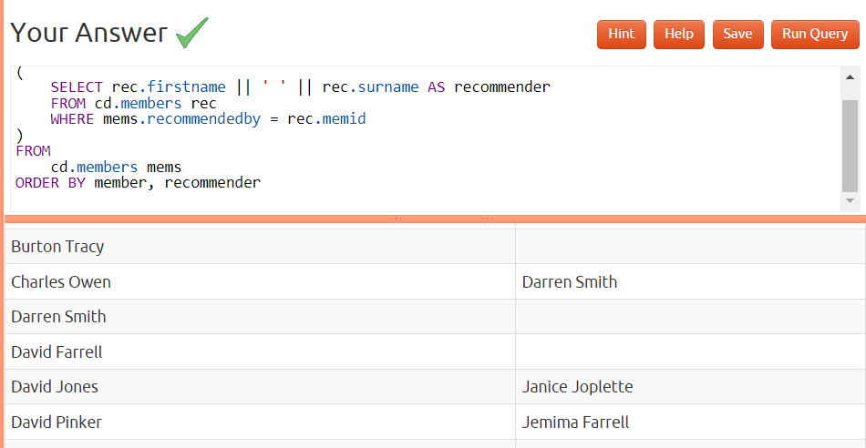   

8) The Produce a list of costly bookings exercise contained some messy logic: we had to calculate the booking cost in both the WHERE clause and the CASE statement. Try to simplify this calculation using subqueries. For reference, the question was:
   How can you produce a list of bookings on the day of 2012-09-14 which will cost the member (or guest) more than $30? Remember that guests have different costs to members (the listed costs are per half-hour 'slot'), and the guest user is always ID 0. Include in your output the name of the facility, the name of the member formatted as a single column, and the cost. Order by descending cost.
   ```sql
   SELECT member, facility, cost from (
	SELECT m.firstname || ' ' || m.surname AS member, f.name AS facility,
  	CASE
  		WHEN m.memid = 0 THEN
  			b.slots*f.guestcost
  		ELSE
  			b.slots*f.membercost
  	END AS cost
  	FROM
  		cd.members m
  		INNER JOIN cd.bookings b
  			ON m.memid = b.memid
  		INNER JOIN cd.facilities f
  			ON f.facid = b.facid
  	WHERE b.starttime::date = '2012-09-14'
   ) AS bookings
   WHERE cost > 30
   ORDER BY cost DESC;
   ```
   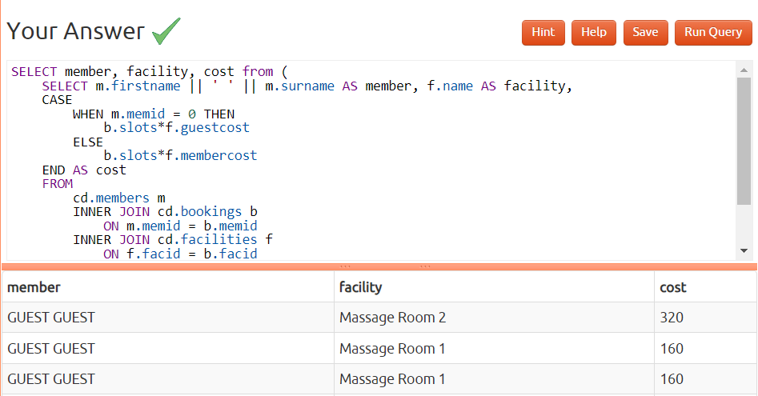

## Aggregates
_____________
1) Count the number of facilities
   ```sql
   SELECT COUNT(facid) FROM cd.facilities
   ```
   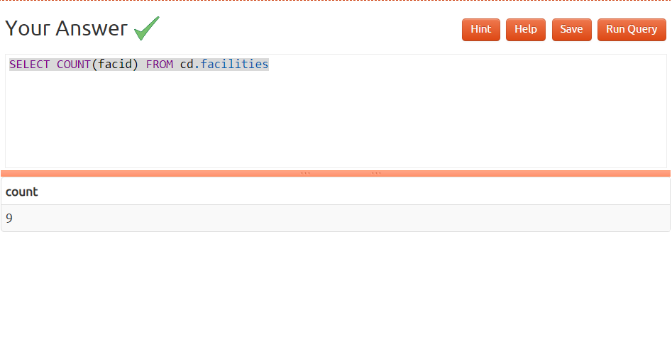

2) Count the number of expensive facilities
   ```sql
   SELECT COUNT(facid) FROM cd.facilities WHERE guestcost >= 10;
   ```
   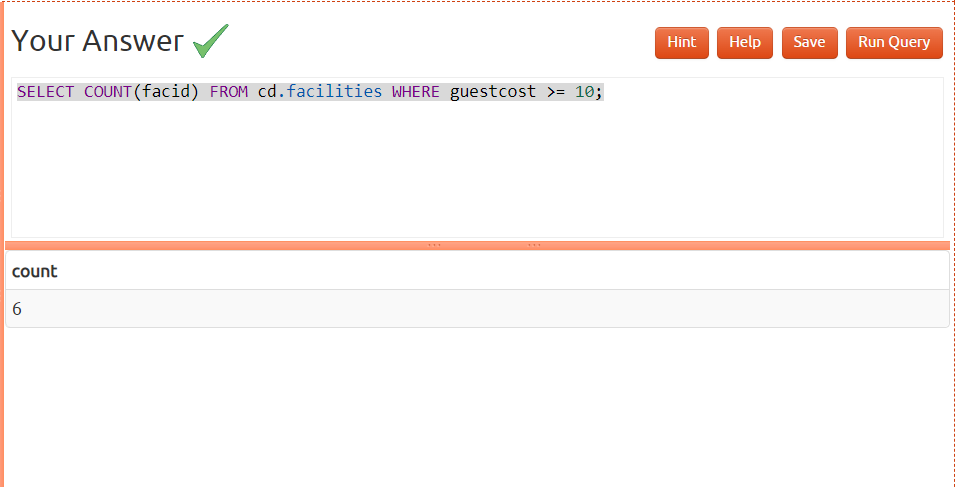

3) Count the number of recommendations each member makes.
   ```sql
   SELECT recommendedby, COUNT(*)
   FROM cd.members
   WHERE recommendedby IS NOT NULL
   GROUP BY recommendedby
   ORDER BY recommendedby
   ```
   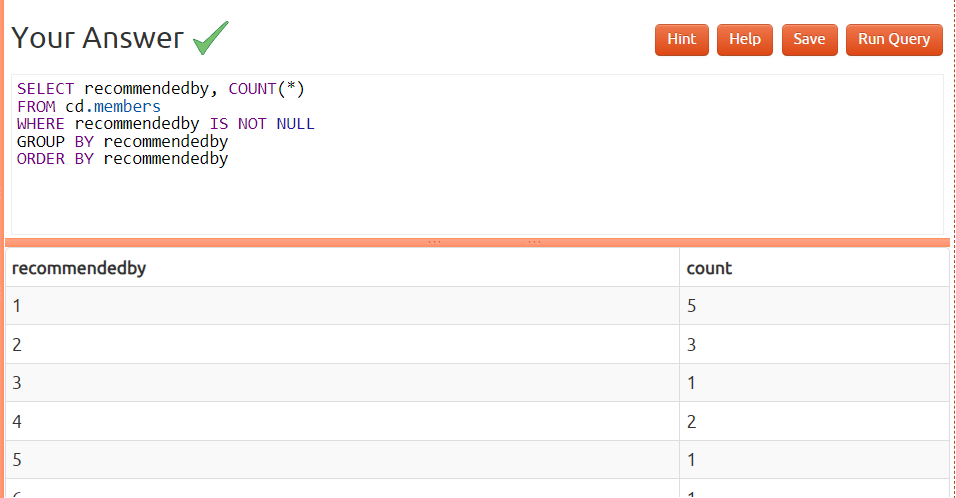

4) List the total slots booked per facility
   ```sql
   SELECT facid, SUM(slots) AS "Total Slots" FROM cd.bookings
   GROUP BY facid
   ORDER BY facid
   ```
   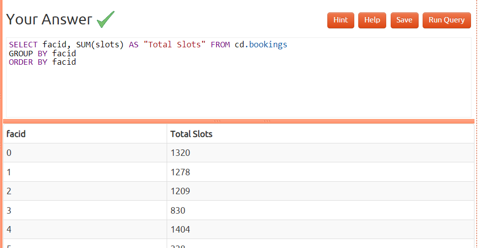

5) Produce a list of the total number of slots booked per facility in the month of September 2012. Produce an output table consisting of facility id and slots, sorted by the number of slots.
   ```sql
   SELECT FACID, SUM(SLOTS) AS "Total Slots"
   FROM CD.BOOKINGS
   WHERE STARTTIME >= '2012-09-01' AND STARTTIME < '2012-10-01'
   GROUP BY FACID
   ORDER BY "Total Slots"
   ```
   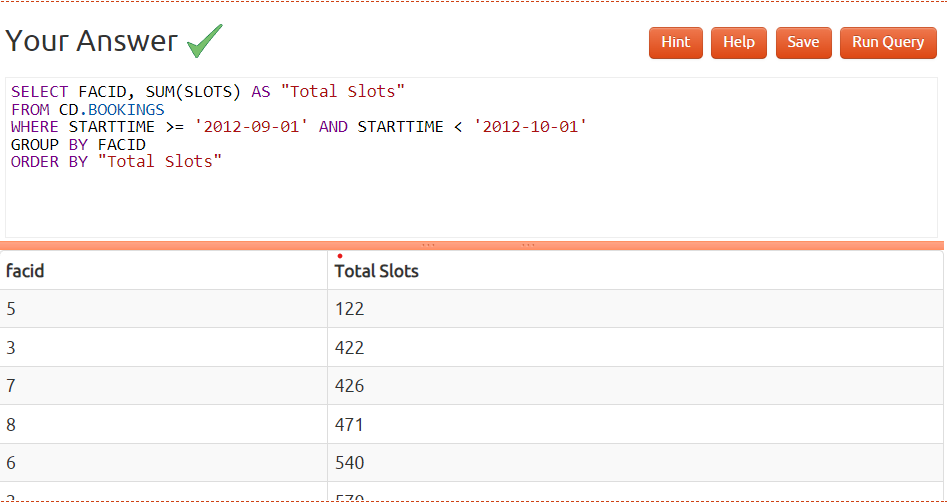

6) 