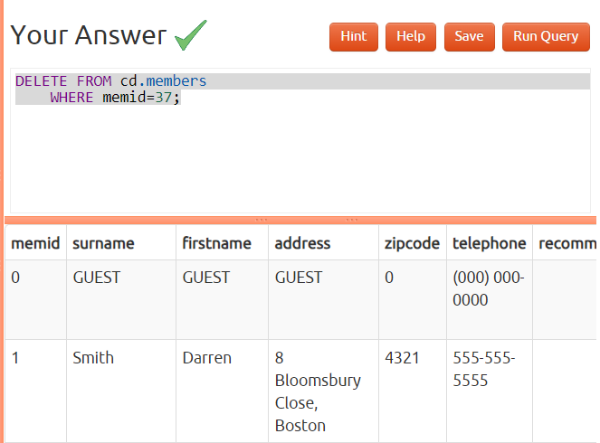

### Day 3

## Data Manipulation
____________________

1) Insert some data into a table
    ```sql
   INSERT INTO cd.facilities
    VALUES(9, 'Spa', 20, 30, 100000, 800)
   ```
   

2) Insert multiple rows of data into a table
   ```sql
   INSERT INTO CD.FACILITIES
    VALUES (9, 'Spa', 20, 30, 100000, 800),
    (10, 'Squash Court 2', 3.5, 17.5, 5000, 80);
   ```
   

3) Insert calculated data into a table
   ```sql
   INSERT INTO CD.FACILITIES
	SELECT(SELECT MAX(FACID) FROM CD.FACILITIES)+1, 'Spa', 20, 30, 100000, 800
   ```
   

4) Update some existing data
   ```sql
   UPDATE CD.FACILITIES
   SET INITIALOUTLAY=10000
   WHERE FACID=1
   ```
   

5) Update multiple rows and columns at the same time
   ```sql
   UPDATE cd.facilities
	SET
		membercost=6,
		guestcost=30
	WHERE
		facid in (0,1);
   ```
   

6) Update a row based on the contents of another row
   ```sql
   update cd.facilities facs
    set
        membercost = facs2.membercost * 1.1,
        guestcost = facs2.guestcost * 1.1
    from (select * from cd.facilities where facid = 0) facs2
    where facs.facid = 1;
   ```
   

7) Delete all bookings
   ```sql
   DELETE FROM cd.bookings
   ```
   

8) Delete a member from the cd.members table
   ```sql
   DELETE FROM cd.members
	WHERE memid=37;
   ```
   


## Strings
_______

1) Format the names of members
   ```sql
   SELECT surname || ', ' || firstname name FROM cd.members
   ```
   

2) Find facilities by a name prefix
   ```sql
   SELECT * FROM cd.facilities WHERE name LIKE 'Tennis%'
   ```
   

3) Perform a case-insensitive search
   ```sql
   SELECT * FROM cd.facilities WHERE UPPER(name) LIKE 'TENNIS%'
   ```
   

4) Find telephone numbers with parentheses
   ```sql
   SELECT memid, telephone FROM cd.members WHERE telephone ~ '[()]';
   ```
   

5) Pad zip codes with leading zeroes
   ```sql
   SELECT lpad(cast(zipcode as char(5)), 5, '0') zip FROM cd.members ORDER BY zip;
   ```
   

6) Count the number of members whose surname starts with each letter of the alphabet
   ```sql
   SELECT SUBSTR(mems.surname, 1, 1) AS letter, COUNT(*) as count
	FROM cd.members mems
	GROUP BY letter
	ORDER BY letter
   ```
   

7) Clean up telephone numbers
   ```sql
   SELECT memid, translate(telephone, '-() ', '') as telephone
	FROM cd.members
	ORDER BY memid
   ```
   

## Date

--------

1) Produce a timestamp for 1 a.m. on the 31st of August 2012
   ```sql
   SELECT timestamp '2012-08-31 01:00:00';
   ```
   

2) Subtract timestamps from each other
   ```sql
   SELECT timestamp '2012-08-31 01:00:00' - timestamp '2012-07-30 01:00:00' as interval
   ```
   

3) Generate a list of all the dates in October 2012
   ```sql
   SELECT GENERATE_SERIES(timestamp '2012-10-01', timestamp '2012-10-31', interval '1 day') as ts;
   ```
   

4) Get the day of the month from a timestamp
   ```sql
   SELECT extract(day from timestamp '2012-08-31');
   ```
   

5) Work out the number of seconds between timestamps
   ```sql
   SELECT CAST(EXTRACT(EPOCH FROM (timestamp '2012-09-02 00:00:00' - '2012-08-31 01:00:00')) AS integer) AS date_part;
   ```
   

6) Work out the number of days in each month of 2012
   ```sql
   SELECT EXTRACT(month FROM cal.month) AS month,
	(cal.month + interval '1 month') - cal.month AS length
	FROM
	(
		SELECT generate_series(timestamp '2012-01-01', timestamp '2012-12-01', interval '1 month') AS month
	) cal
   ORDER BY month;
   ```
   

7) Work out the number of days remaining in the month
   ```sql
   SELECT (date_trunc('month', ts.testts) + interval '1 month')
		- date_trunc('day', ts.testts) as remaining
	FROM (SELECT timestamp '2012-02-11 01:00:00' as testts) ts
   ```
   

8) Work out the end time of bookings
   ```sql
   SELECT starttime, starttime + slots*(interval '30 minutes') endtime
	FROM cd.bookings
	ORDER BY endtime DESC, starttime DESC
	LIMIT 10;
   ```
   

9) Return a count of bookings for each month
   ```sql
   SELECT date_trunc('month',  starttime) AS month, count(*)
	FROM cd.bookings
	GROUP BY month
	ORDER BY month
   ```
   

10) Work out the utilisation percentage for each facility by month
   ```sql
   SELECT name, month,
    ROUND((100 * slots) /
        CAST(
            25 * (CAST((month + interval '1 month') AS date)
                  - CAST(month AS date)) AS numeric),
         1) AS utilisation
    FROM (
     SELECT facs.name AS name,
            DATE_TRUNC('month', starttime) AS month,
               SUM(slots) AS slots
        FROM cd.bookings bks
        INNER JOIN cd.facilities facs
        ON bks.facid = facs.facid
         GROUP BY facs.facid, month
    ) AS inn
    ORDER BY name, month;
   ```
   